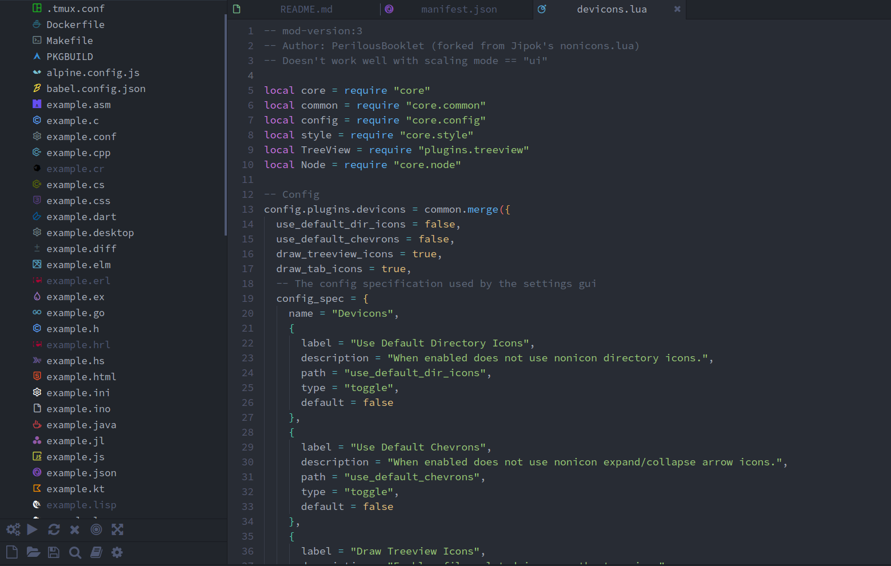
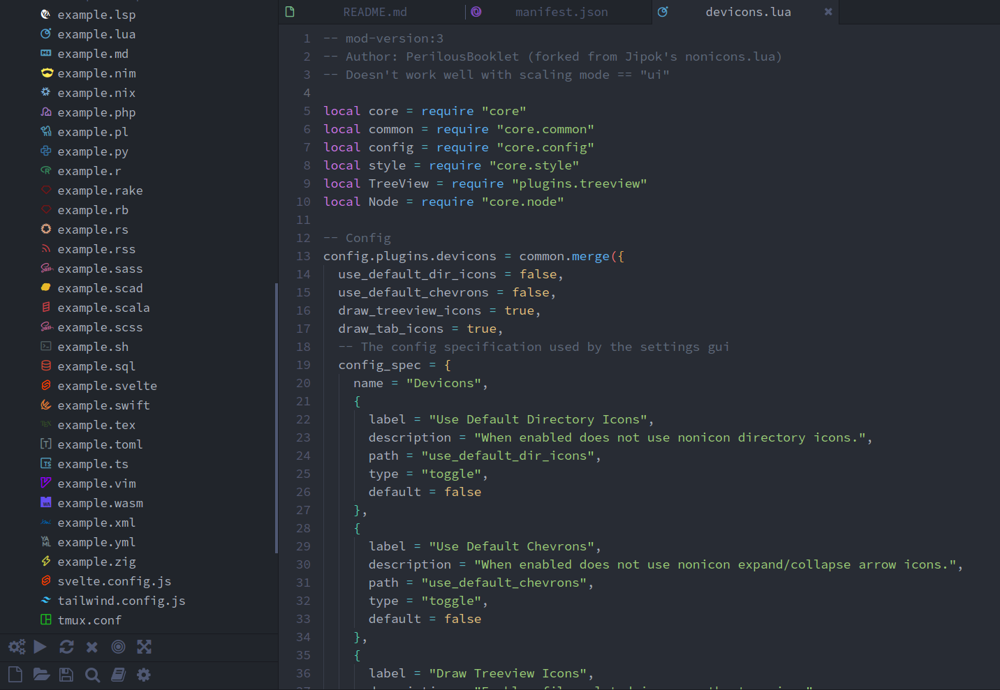

# Devicons for Lite XL's project tree view





## Supported programming languages

<!-- TODO: update link -->
Check the [Lite XL IDE plugin page](https://github.com/lite-xl/lite-xl-ide-adam?tab=readme-ov-file#lite-xl-ide).

## How to install

> [!WARNING]  
> `devicons` is currently undergoing maintenance.
> Anyone who wants to use `devicons` now should uninstall it with `lpm` (if it was previously installed) and just copy/paste the `devicons.lua` and `devicons.ttf` files.

Open a terminal window and run the following commands:
```sh
lpm repo add "https://github.com/PerilousBooklet/lite-xl-devicons"
lpm install devicons
```

<!-- WIP: waiting for the toolbarview PR merge
 -->
## How to create a custom icon font

Follow the official guide ...

<!-- ## Sources -->
<!-- WIP -->
<!-- - [VSCode File Icons](https://github.com/vscode-icons/vscode-icons/wiki/ListOfFiles) -->
<!-- - [VSCode Language Syntax Files](https://github.com/microsoft/vscode/tree/main/extensions) -->

## Credits
- https://github.com/yamatsum/nonicons
- https://github.com/lite-xl/lite-xl-plugins/blob/master/plugins/nonicons.lua

